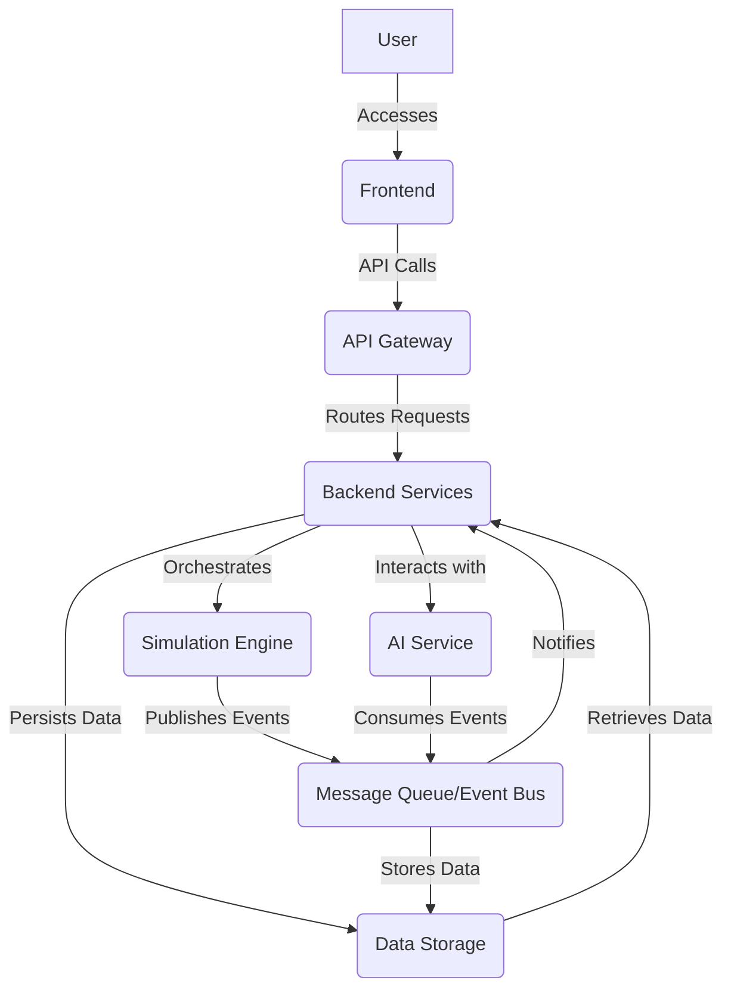

# Architecture Design: Architech

## 1. Introduction

This document outlines the high-level architecture of Architech, a web-based systems design simulation studio. The architecture is designed to be modular, scalable, extensible, and maintainable, adhering to modern software engineering principles such as separation of concerns, loose coupling, and high cohesion. We aim for a robust and performant system capable of handling complex simulations and providing real-time interactive experiences.

## 2. Guiding Principles

The architectural design of Architech is guided by the following principles:

*   **Modularity:** The system is composed of independent, self-contained modules with well-defined interfaces. This promotes reusability, simplifies development, and enhances maintainability.
*   **Scalability:** The architecture is designed to scale horizontally to accommodate a growing number of users and increasingly complex simulations. This involves stateless components where possible and efficient resource management.
*   **Extensibility:** The platform should be easily extendable to support new components, simulation models, and AI capabilities without requiring significant changes to the core system.
*   **Performance:** Critical paths, especially the simulation engine, are optimized for speed and efficiency to provide a responsive user experience.
*   **Observability:** The system is designed with observability in mind, incorporating logging, metrics, and tracing to facilitate monitoring, debugging, and performance analysis.
*   **Security:** Security is a paramount concern, with measures implemented at all layers to protect user data and intellectual property.
*   **User Experience (UX):** The frontend is designed to be intuitive, responsive, and visually appealing, providing a seamless experience for complex system design.

## 3. High-Level Architecture Overview

Architech follows a microservices-oriented architecture, separating concerns into distinct, independently deployable services. This allows for flexibility in technology choices, independent scaling, and improved fault isolation. The primary components are:

*   **Frontend (Client-side Application):** A rich web application providing the visual design canvas, simulation controls, and observability dashboards.
*   **Backend Services (APIs & Business Logic):** A set of microservices handling user management, project management, design persistence, and orchestration of simulations.
*   **Simulation Engine:** The core computational component responsible for executing system simulations, modeling component behaviors, and injecting faults.
*   **AI Service:** A dedicated service for providing intelligent feedback, anti-pattern detection, and design pattern suggestions.
*   **Data Storage:** Various databases optimized for different data types (e.g., relational for user/project data, NoSQL for simulation results, graph database for architectural relationships).
*   **Message Queue/Event Bus:** Facilitates asynchronous communication between services, ensuring loose coupling and enabling event-driven architectures.

## 4. Component Breakdown

### 4.1. Frontend

*   **Technology Stack:** React/Vue/Angular (e.g., React), TypeScript, WebGL/Canvas for rendering the visual design canvas (e.g., Konva.js, PixiJS), D3.js for data visualization.
*   **Responsibilities:**
    *   Provides the interactive drag-and-drop visual editor for system components.
    *   Manages user interactions, including component placement, connection, and property editing.
    *   Displays real-time simulation progress, logs, metrics, and traces.
    *   Handles user authentication and authorization flows (via Backend Services).
    *   Renders complex architectural diagrams and simulation results.

### 4.2. Backend Services

Implemented as a suite of microservices, potentially using a framework like Spring Boot (Java), Node.js (Express/NestJS), or FastAPI (Python). Each service will have a single, well-defined responsibility.

*   **API Gateway:** (e.g., Nginx, Kong, AWS API Gateway)
    *   Acts as the single entry point for all client requests.
    *   Handles request routing, load balancing, authentication, and rate limiting.
    *   Aggregates responses from multiple microservices.
*   **User Management Service:**
    *   Manages user accounts, authentication (e.g., OAuth2, JWT), and authorization.
    *   Stores user profiles and preferences.
*   **Project Service:**
    *   Manages project creation, retrieval, updates, and deletion.
    *   Stores project metadata and references to architectural designs.
*   **Design Service:**
    *   Manages the persistence and versioning of system designs.
    *   Stores component configurations, connections, and simulation parameters.
    *   Potentially uses a graph database to represent architectural relationships efficiently.
*   **Simulation Orchestration Service:**
    *   Receives requests to start, stop, and manage simulations.
    *   Communicates with the Simulation Engine to initiate and control simulation runs.
    *   Collects simulation results and stores them.
*   **Observability Data Service:**
    *   Ingests logs, metrics, and traces generated by the Simulation Engine.
    *   Provides APIs for querying and visualizing observability data.

### 4.3. Simulation Engine

This is the computational core of Architech, likely implemented in a high-performance language like Go or Rust, or a performant Python framework. It needs to be highly optimized for discrete-event simulation.

*   **Core Logic:** Implements the discrete-event simulation logic, advancing time based on events (e.g., request arrival, processing completion, network delay).
*   **Component Models:** Contains a library of pre-defined component models (e.g., CPU, memory, network, database, queue) with configurable behaviors and parameters.
*   **Fault Injection Module:** Responsible for introducing various failure scenarios into the simulation based on user-defined policies.
*   **Resource Management:** Simulates resource contention and utilization (CPU, memory, network bandwidth).
*   **Event Emitter:** Publishes simulation events (e.g., request processed, error occurred, metric updated) to the Message Queue/Event Bus for consumption by other services.

### 4.4. AI Service

Leverages machine learning models to provide intelligent insights. This service could be implemented using Python with frameworks like TensorFlow or PyTorch.

*   **Anti-pattern Detection Module:** Analyzes the system design and simulation results to identify common distributed system anti-patterns.
*   **Design Pattern Recommendation Module:** Suggests relevant design patterns based on identified problems or desired system characteristics.
*   **Performance Optimization Module:** Analyzes simulation metrics to recommend performance improvements.
*   **Natural Language Processing (NLP) Module:** Potentially for interpreting natural language queries for design assistance.

### 4.5. Data Storage

Architech will utilize a polyglot persistence strategy, choosing the best database for each specific data need.

*   **PostgreSQL/MySQL (Relational Database):** For structured data like user accounts, project metadata, and component definitions. Provides strong consistency and transactional support.
*   **MongoDB/Cassandra (NoSQL Database):** For storing large volumes of semi-structured or unstructured simulation results, logs, and metrics. Offers high scalability and flexibility.
*   **Neo4j/ArangoDB (Graph Database):** Potentially for storing and querying complex architectural relationships and dependencies between components, enabling efficient analysis of system topology.

### 4.6. Message Queue / Event Bus

(e.g., Apache Kafka, RabbitMQ, AWS SQS/SNS)

*   Facilitates asynchronous, decoupled communication between microservices.
*   Enables event-driven architectures, where services react to events published by others.
*   Ensures reliable message delivery and supports high throughput.

## 5. Key Architectural Considerations

### 5.1. Scalability

*   **Stateless Services:** Design backend services to be stateless where possible, allowing for easy horizontal scaling.
*   **Asynchronous Communication:** Utilize message queues to decouple services and handle peak loads gracefully.
*   **Database Sharding/Replication:** Implement strategies for scaling data storage to handle growing data volumes and read/write loads.
*   **Containerization & Orchestration:** Deploy services using Docker and orchestrate with Kubernetes for automated scaling, healing, and deployment.

### 5.2. Resilience

*   **Redundancy:** Deploy multiple instances of critical services across different availability zones.
*   **Circuit Breakers & Retries:** Implement resilience patterns within services to prevent cascading failures.
*   **Graceful Degradation:** Design the system to maintain core functionality even when some components are under stress or unavailable.
*   **Automated Backups & Disaster Recovery:** Regular backups of all persistent data with defined recovery procedures.

### 5.3. Performance

*   **Optimized Simulation Engine:** Focus on efficient algorithms and data structures within the simulation core.
*   **Caching:** Implement caching mechanisms (e.g., Redis) for frequently accessed data.
*   **Efficient Data Transfer:** Use optimized serialization formats (e.g., Protobuf, Avro) for inter-service communication.
*   **Load Testing:** Continuously perform load testing on the simulation engine and backend services.

### 5.4. Security

*   **Authentication & Authorization:** Implement robust identity management and fine-grained access control.
*   **Data Encryption:** Encrypt data at rest and in transit.
*   **Vulnerability Scanning:** Regularly scan for security vulnerabilities in code and dependencies.
*   **Least Privilege:** Adhere to the principle of least privilege for all service accounts and user roles.

### 5.5. Maintainability

*   **Clear Code Structure:** Adhere to clean code principles and maintainable codebases.
*   **Comprehensive Documentation:** Keep architectural and technical documentation up-to-date.
*   **Automated Testing:** Implement extensive unit, integration, and end-to-end tests.
*   **CI/CD Pipelines:** Automate build, test, and deployment processes.

## 6. Future Considerations

*   **WebAssembly for Simulation Engine:** Explore running parts of the simulation engine directly in the browser using WebAssembly for enhanced client-side performance and reduced server load.
*   **Edge Computing for Real-time Feedback:** Deploy AI inference models closer to the user for lower latency feedback.
*   **Integration with IaC Tools:** Develop modules to import/export designs from/to popular Infrastructure as Code frameworks (Terraform, CloudFormation).
*   **Domain-Specific Languages (DSLs):** Consider developing a DSL for defining complex component behaviors or simulation scenarios.

---

**Author:** Manus AI

**Date:** 2025-07-17

