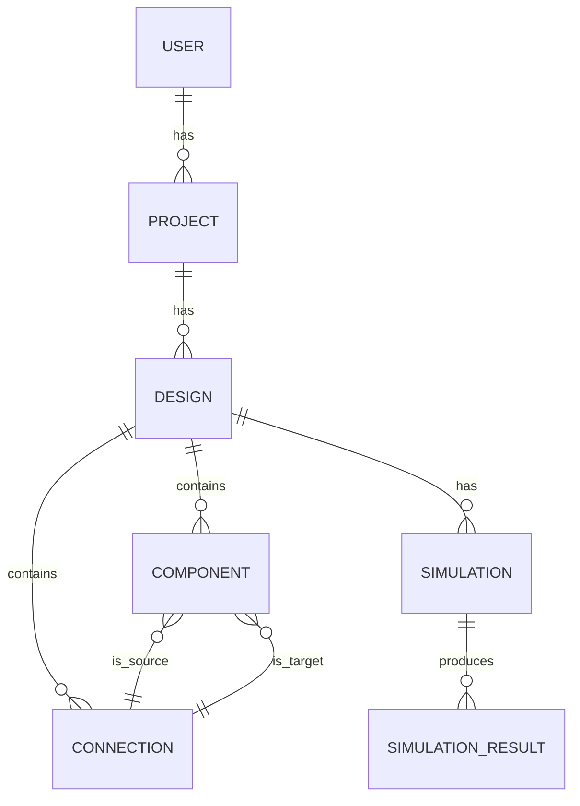

# Data Model: Architech

## 1. Introduction

This document outlines the data model for Architech, detailing the structure and relationships of the data stored and managed by the platform. A well-designed data model is crucial for ensuring data integrity, scalability, and performance. Architech will employ a polyglot persistence strategy, using different database technologies to best suit the needs of different data types.

## 2. Logical Data Model

### 2.1. Core Entities

*   **User:** Represents an individual user of the Architech platform.
    *   `user_id` (Primary Key)
    *   `username`
    *   `email`
    *   `password_hash`
    *   `created_at`
    *   `updated_at`
*   **Project:** Represents a user-created system design project.
    *   `project_id` (Primary Key)
    *   `user_id` (Foreign Key to User)
    *   `name`
    *   `description`
    *   `created_at`
    *   `updated_at`
*   **Design:** Represents a specific version or snapshot of a system architecture within a project.
    *   `design_id` (Primary Key)
    *   `project_id` (Foreign Key to Project)
    *   `version`
    *   `is_latest`
    *   `created_at`
*   **Component:** Represents a single component (e.g., service, database, queue) within a design.
    *   `component_id` (Primary Key)
    *   `design_id` (Foreign Key to Design)
    *   `type` (e.g., `SERVICE`, `DATABASE`, `QUEUE`)
    *   `name`
    *   `properties` (JSONB field for storing component-specific configuration, e.g., `{ "processing_time": 50, "retry_policy": "exponential_backoff" }`)
    *   `position` (JSONB field for storing x/y coordinates on the canvas)
*   **Connection:** Represents a directed link between two components within a design.
    *   `connection_id` (Primary Key)
    *   `design_id` (Foreign Key to Design)
    *   `source_component_id` (Foreign Key to Component)
    *   `target_component_id` (Foreign Key to Component)
    *   `properties` (JSONB field for storing connection-specific configuration, e.g., `{ "latency": 10, "packet_loss_rate": 0.01 }`)
*   **Simulation:** Represents a single simulation run for a specific design.
    *   `simulation_id` (Primary Key)
    *   `design_id` (Foreign Key to Design)
    *   `start_time`
    *   `end_time`
    *   `status` (e.g., `RUNNING`, `COMPLETED`, `FAILED`)
    *   `configuration` (JSONB field for storing simulation parameters, e.g., request rate, fault injection scenario)
*   **SimulationResult:** Stores the high-level results of a simulation.
    *   `result_id` (Primary Key)
    *   `simulation_id` (Foreign Key to Simulation)
    *   `summary_metrics` (JSONB field for storing aggregate metrics, e.g., total throughput, average end-to-end latency)

### 2.2. Entity-Relationship Diagram (ERD)



## 3. Physical Data Model

This section describes the physical implementation of the logical data model using specific database technologies.

### 3.1. Relational Database (PostgreSQL)

A relational database like PostgreSQL will be used for storing structured, transactional data that requires strong consistency.

*   **Schema:**
    *   `users` table (for User entity)
    *   `projects` table (for Project entity)
    *   `designs` table (for Design entity)
    *   `components` table (for Component entity)
    *   `connections` table (for Connection entity)
    *   `simulations` table (for Simulation entity)
    *   `simulation_results` table (for SimulationResult entity)
*   **Justification:** PostgreSQL provides robust support for transactions, data integrity constraints (foreign keys), and complex queries. Its JSONB support is also ideal for storing flexible component and connection properties.

### 3.2. Time-Series Database (e.g., InfluxDB, Prometheus)

A time-series database will be used for storing the detailed time-series data generated during simulations, such as metrics.

*   **Schema:**
    *   A measurement for each metric type (e.g., `latency`, `cpu_utilization`, `queue_depth`).
    *   Tags to identify the source of the metric (e.g., `simulation_id`, `component_id`, `component_type`).
    *   Fields to store the metric values.
    *   A timestamp for each data point.
*   **Example Data Point (InfluxDB Line Protocol):**
    ```
    latency,simulation_id=sim123,component_id=comp456,component_type=SERVICE value=120.5 1678886400000000000
    ```
*   **Justification:** Time-series databases are highly optimized for ingesting, storing, and querying large volumes of timestamped data. They provide efficient compression and fast aggregation capabilities, which are essential for analyzing simulation metrics.

### 3.3. Document Database (e.g., MongoDB) or Log Management System (e.g., Elasticsearch)

A document-oriented database or a dedicated log management system will be used for storing simulation logs and traces.

*   **Schema (for Logs):**
    *   Each log entry will be a document with fields like `timestamp`, `simulation_id`, `component_id`, `log_level`, `message`.
*   **Schema (for Traces):**
    *   Each trace will be a collection of span documents, following a standard format like OpenTelemetry. Each span will have fields like `trace_id`, `span_id`, `parent_span_id`, `service_name`, `start_time`, `end_time`, `status`, and `attributes`.
*   **Justification:** Document databases and log management systems excel at storing and indexing large volumes of semi-structured text data. They provide powerful search and aggregation capabilities, which are crucial for debugging and analyzing simulation logs and traces.

## 4. Data Flow

1.  **Design Creation:** When a user creates a system design, the `User`, `Project`, `Design`, `Component`, and `Connection` data is stored in the PostgreSQL database.
2.  **Simulation Execution:**
    *   A new `Simulation` record is created in PostgreSQL.
    *   As the simulation runs, the simulation engine generates logs, metrics, and traces.
    *   Logs and traces are sent to the Document Database/Log Management System.
    *   Metrics are sent to the Time-Series Database.
3.  **Simulation Completion:**
    *   The `Simulation` record in PostgreSQL is updated with a `COMPLETED` status.
    *   A `SimulationResult` record with summary metrics is created in PostgreSQL.
4.  **Data Retrieval:**
    *   When a user views a design, the data is retrieved from PostgreSQL.
    *   When a user views simulation results, summary data is retrieved from PostgreSQL, while detailed metrics, logs, and traces are retrieved from their respective specialized databases.

## 5. Data Management Considerations

*   **Data Integrity:** Foreign key constraints in PostgreSQL will ensure relational integrity.
*   **Scalability:** The use of specialized databases for time-series and log data will allow the system to scale to handle large volumes of simulation output.
*   **Data Retention:** Policies will be implemented for archiving or deleting old simulation data to manage storage costs.
*   **Security:** All sensitive data will be encrypted at rest and in transit. Access to data will be controlled through role-based access control (RBAC).

---

**Author:** Manus AI

**Date:** 2025-07-17


